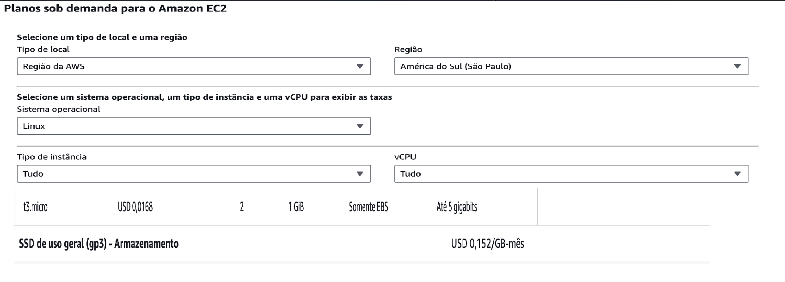
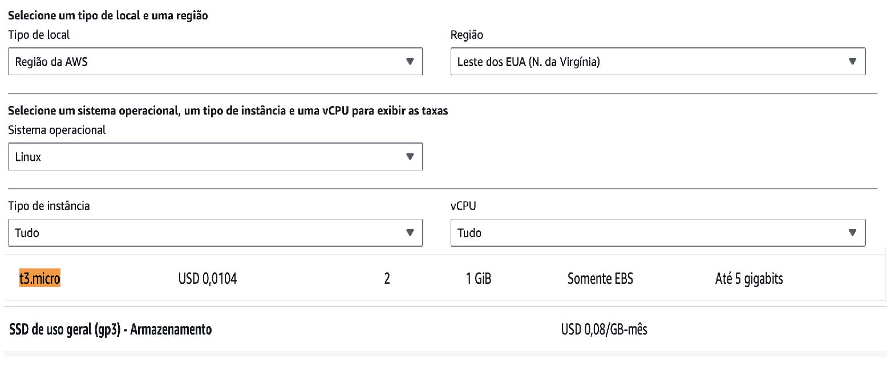
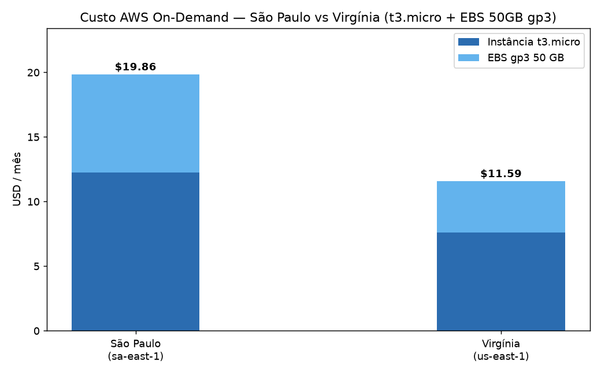
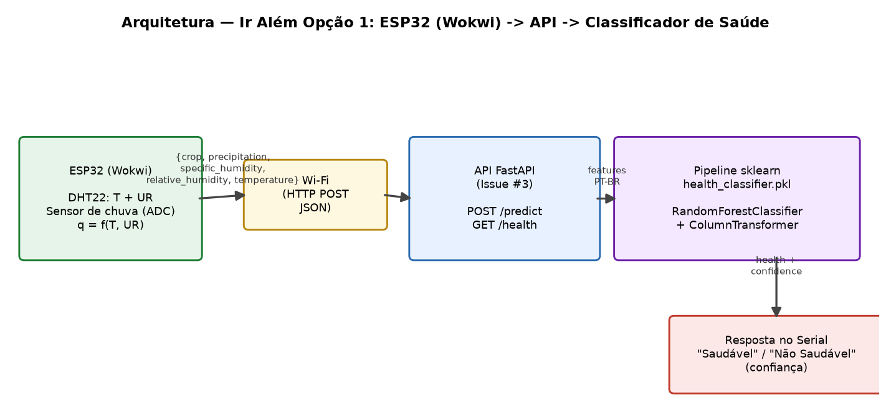

# 🌾 FarmTech Solutions — PBL Fase 5 | Machine Learning & Nuvem

> **Predição de rendimento de safra com regressão supervisionada, clusterização de tendências e estimativa de custos em nuvem AWS.**

---

## 👨‍🎓 Integrantes

| Nome | RM | GitHub |
|------|----|--------|
| Henrique Sanches Silva | RM 570527 | [@HenriqueSanchesSilva](https://github.com/HenriqueSanchesSilva) |
| João Pedro Zavanela Andreu | RM 570231 | [@zjpza](https://github.com/zjpza) |
| Kayck Gabriel Evangelista da Silva | RM 572331 | [@Kayckxz](https://github.com/Kayckxz) |
| Luis Henrique Laurentino Boschi | RM 571352 | [@lhboschi](https://github.com/lhboschi) |
| Patrick Borges de Melo | RM 574030 | [@Trickmelo](https://github.com/Trickmelo) |

**Tutora:** Sabrina Otoni
**Coordenador:** André Godoi

> **FIAP — Inteligência Artificial | Turma: 1TIAOB-2026**

---

## 📜 Visão Geral

Este repositório contempla as **duas entregas obrigatórias** da Fase 5:

| Entrega | Tema | Onde está |
|---------|------|-----------|
| **Entrega 1** | Machine Learning — análise exploratória, clusterização e 5 modelos de regressão para prever rendimento de safra | [`notebooks/`](notebooks/) |
| **Entrega 2** | Computação em Nuvem — estimativa de custos AWS comparando São Paulo (BR) vs Virgínia do Norte (EUA) | Seção [☁️ Entrega 2 — Nuvem AWS](#-entrega-2--nuvem-aws) abaixo |

O detalhamento técnico completo (código, gráficos, achados e conclusões) está no **Jupyter Notebook**. Este README é apenas uma introdução que conduz o leitor até ele.

---

## 🎯 Entrega 1 — Machine Learning

A FarmTech Solutions atende uma fazenda de médio porte (≈200 ha) que produz várias culturas. A partir de uma base com condições de solo e clima (precipitação, umidade, temperatura), o grupo:

1. **Analisa exploratoriamente** a base `crop_yield.csv`;
2. **Clusteriza** os rendimentos para identificar tendências e cenários discrepantes (outliers);
3. **Constrói 5 modelos preditivos** com algoritmos distintos de regressão supervisionada, seguindo boas práticas de ML (split, pipeline, validação cruzada, métricas pertinentes).

### Variáveis do dataset

| Variável | Descrição |
|----------|-----------|
| `Cultura` | Nome da safra (categórica) |
| `Precipitação (mm dia 1)` | Chuva em mm/dia |
| `Umidade específica a 2 metros (g/kg)` | Vapor de água por kg de ar seco |
| `Umidade relativa a 2 metros (%)` | Umidade relativa do ar |
| `Temperatura a 2 metros (ºC)` | Temperatura a 2 m do solo |
| `Rendimento` | Rendimento em toneladas por hectare (alvo) |

### 📒 Notebook

➡️ [`notebooks/JoaoPedroZavanelaAndreu_rm570231_pbl_fase5.ipynb`](notebooks/JoaoPedroZavanelaAndreu_rm570231_pbl_fase5.ipynb)

> O notebook contém células de código executadas e comentadas, além de células markdown com a análise, achados, pontos fortes e limitações do trabalho.

### 🎥 Vídeo demonstrativo (Entrega 1)

[🔗 Link do vídeo no YouTube — não listado](_PLACEHOLDER_VIDEO_ENTREGA1_)

---

## ☁️ Entrega 2 — Nuvem AWS

### Cenário

A Machine Learning da Entrega 1 precisa ser hospedada em nuvem para receber dados dos sensores da fazenda e executar a inferência. A missão é cotar, na **calculadora da AWS** (modelo On-Demand — 100%), uma máquina Linux simples comparando:

- **Região São Paulo (BR)** — `sa-east-1`
- **Região Virgínia do Norte (EUA)** — `us-east-1`

### Configuração exigida

| Recurso | Especificação |
|---------|---------------|
| vCPU | 2 |
| Memória | 1 GiB |
| Rede | Até 5 Gigabit |
| Armazenamento (HD) | 50 GB |

### Instância selecionada

A instância **`t3.micro`** atende exatamente à configuração exigida: 2 vCPU, 1 GiB de RAM,
rede "Up to 5 Gigabit" e armazenamento via EBS. (A `t3.small` tem 2 GiB — mais RAM do que o
pedido; a `t3.micro` é a correspondência exata.)

| Instância | vCPU | RAM | Rede | Região |
|-----------|------|-----|------|--------|
| `t3.micro` | 2 | 1 GiB | Até 5 Gbps | sa-east-1 / us-east-1 |

### Comparativo de custos (On-Demand, Linux, 730 h/mês)

Valores em USD, coletados na calculadora AWS / tabela pública de preços (referência 2025).
BRL indicativo a ≈ R$ 5,50 / US$ 1.

| Componente | São Paulo (sa-east-1) | Virgínia (us-east-1) |
|------------|----------------------|----------------------|
| Instância t3.micro (On-Demand) | $0,0168/h → **$12,26/mês** | $0,0104/h → **$7,59/mês** |
| Volume EBS 50 GB (gp3) | $0,152/GB-mês → **$7,60/mês** | $0,08/GB-mês → **$4,00/mês** |
| **Total mensal (USD)** | **$19,86** | **$11,59** |
| Total mensal (BRL ≈5,50) | ≈ R$ 109,23 | ≈ R$ 63,75 |

> São Paulo custa **~71% mais caro** que a Virgínia neste perfil (instância + EBS).






### Justificativa técnica

> **Considerando:** (1) necessidade de acesso rápido aos dados dos sensores e (2) restrições
> legais para armazenamento no exterior.

- **Latência de rede:** os sensores da fazenda enviam dados continuamente. Hospedar em
  `us-east-1` (Virgínia) impõe um round-trip BR→EUA da ordem de ~120 ms, contra <5 ms em
  `sa-east-1` (São Paulo). Para inferência em tempo (quase) real de saúde da plantação, a
  menor latência melhora a responsividade e reduz o risco de timeout em leituras
  frequentes.
- **Conformidade com a LGPD:** os dados de sensores agrícolas (clima + cultura) podem ser
  considerados dados da atividade rural/econômica. Manter o armazenamento e processamento
  em território nacional (`sa-east-1`) facilita o atendimento à LGPD e a eventuais
  exigências regulatórias de soberania de dados, além de simplificar auditorias.
- **Viabilidade econômica:** São Paulo é ~71% mais cara ($19,86 vs $11,59/mês), diferença
  de ~$8,27/mês (~R$ 46). Em valor absoluto o custo é baixo; a diferença é facilmente
  absorvida diante do benefício de latência e conformidade.
- **Conclusão:** apesar do custo maior, escolhe-se **`sa-east-1` (São Paulo)**, pois o
  ganho de latência (<5 ms) e o alinhamento à LGPD/soberania de dados superam a diferença
  de custo (que permanece pequena em valor absoluto para uma única instância pequena).

### 🎥 Vídeo demonstrativo (Entrega 2)

[🔗 Link do vídeo no YouTube — não listado](_PLACEHOLDER_VIDEO_ENTREGA2_)

---

## 🚀 Como executar o notebook

### Pré-requisitos

- Python 3.10+
- pip

### Instalação

```bash
git clone https://github.com/zjpza/fase-5-pbl-agro.git
cd fase-5-pbl-agro

python -m venv venv
# Linux/Mac
source venv/bin/activate
# Windows
venv\Scripts\activate

pip install -r requirements.txt
```

### Executar

```bash
jupyter notebook notebooks/JoaoPedroZavanelaAndreu_rm570231_pbl_fase5.ipynb
```

> O dataset `crop_yield.csv` deve estar em `data/`.

---

## 📁 Estrutura do repositório

```
fase-5-pbl-agro/
├── README.md                              # Intro + Entrega 2 (AWS) + Ir Além
├── requirements.txt                       # Dependências (ML + API)
├── .gitignore
├── data/
│   └── crop_yield.csv                     # Dataset (Entrega 1)
├── notebooks/
│   └── JoaoPedroZavanelaAndreu_rm570231_pbl_fase5.ipynb   # Entrega 1 — ML
├── src/
│   ├── api/                               # "Ir Além" Opção 2 — API FastAPI
│   │   ├── main.py                        #   app + /health + /predict
│   │   └── schemas.py                     #   modelos Pydantic
│   ├── esp32/                             # "Ir Além" Opção 1 — ESP32 (Wokwi)
│   │   ├── farmtech_esp32.ino             #   firmware (sensores + POST)
│   │   ├── diagram.json                   #   circuito Wokwi
│   │   └── libraries.txt                  #   libs do Wokwi
│   └── ml/models/                         # modelos serializados (Entrega 1)
│       ├── best_regressor.pkl
│       ├── health_classifier.pkl
│       └── label_map.json
└── assets/                                # Figuras da EDA, modelos e arquitetura
    ├── eda_*.png  cluster_*.png  outliers_*.png  models_*.png
    ├── arquitetura_ir_alem.png            # diagrama do Ir Além
    └── cotacao_sa_east_1.png  cotacao_us_east_1.png  # (Entrega 2 — AWS)
```

---

## 🧭 Ir Além *(opcional, sem nota)*

Implementamos **duas** opções do "Ir Além", que se integram ponta-a-ponta:

- **Opção 2 — Classificação da saúde de plantações com ML:** API FastAPI que carrega o
  classificador serializado na Issue #1 (`src/ml/models/health_classifier.pkl`) e serve
  `/predict` (cultura + condições climáticas -> **Saudável**/**Não Saudável** + confiança).
- **Opção 1 — Coleta de dados com ESP32 + Wi-Fi:** firmware ESP32 (simulado no Wokwi) que
  lê DHT22 e sensor de chuva, calcula a umidade específica e envia `POST /predict` para a
  API, exibindo a classificação no monitor serial.



## Opção 2 — API FastAPI (classificador de saúde)

A API carrega o classificador de saúde serializado na Issue #1 e retorna **Saudável** ou
**Não Saudável** (relativo à mediana de cada cultura), com a confiança da predição.

### Como rodar

```bash
pip install -r requirements.txt
python -m uvicorn src.api.main:app --reload --port 8000
```

Interface interativa (Swagger UI): <http://localhost:8000/docs>

### Endpoints

| Método | Rota | Descrição |
|---------|------|-----------|
| `GET` | `/health` | Status do serviço (`{"status":"ok","model_loaded":true}`) |
| `POST` | `/predict` | Classifica a saúde de uma observação |

**Exemplo de request (`POST /predict`):**

```json
{
  "crop": "Cocoa, beans",
  "precipitation": 2248.92,
  "specific_humidity": 17.72,
  "relative_humidity": 83.4,
  "temperature": 26.01
}
```

**Resposta:**

```json
{ "health": "Saudável", "confidence": 0.84 }
```

> Valores aceitos para `crop`: `Cocoa, beans`, `Oil palm fruit`, `Rice, paddy`,
> `Rubber, natural` (exatamente como no dataset). Outros valores são rejeitados (HTTP 422).

### Arquitetura

O `.pkl` serializado **é o pipeline sklearn completo** (`ColumnTransformer` +
`RandomForestClassifier`), logo o pré-processamento servido pela API é idêntico ao do
treino — sem leakage nem inconsistência. A API apenas mapeia os nomes amigáveis do
esquema de entrada (em inglês) para os nomes PT-BR esperados pelo `ColumnTransformer`
(descritos em `src/ml/models/label_map.json`).

| Arquivo | Função |
|---------|--------|
| [`src/api/main.py`](src/api/main.py) | App FastAPI (lifespan, `/health`, `/predict`) |
| [`src/api/schemas.py`](src/api/schemas.py) | Modelos Pydantic de entrada/saída |

## Opção 1 — ESP32 (Wokwi) coleta sensores e envia para a API

O firmware [`src/esp32/farmtech_esp32.ino`](src/esp32/farmtech_esp32.ino) roda num ESP32
simulado no [Wokwi](https://wokwi.com). A cada ciclo ele:

1. lê **temperatura** e **umidade relativa** do **DHT22**;
2. lê o **sensor de chuva** (analógico, emulado por potenciômetro no Wokwi) e estima a
   precipitação;
3. calcula a **umidade específica** (g/kg) via fórmula meteorológica de Magnus a partir de
   T e UR (reproduz os valores do dataset de treino — ex.: ~17,7 g/kg a 26 °C / 83 %);
4. conecta ao Wi-Fi e envia `POST /predict` com `{crop, precipitation, specific_humidity,
   relative_humidity, temperature}`;
5. exibe no **monitor serial** a classificação `Saudável` / `Não Saudável` e a confiança.

### Circuito (Wokwi)

`src/esp32/diagram.json` monta: ESP32 DevKit V1 + DHT22 (GPIO4) + potenciômetro como sensor
de chuva analógico (GPIO34, ADC1 — compatível com Wi-Fi). Bibliotecas em
`src/esp32/libraries.txt` (Adafruit DHT + Unified Sensor).

### Justificativa dos sensores e alinhamento com a FarmTech

Os sensores espelham as features climáticas usadas no treino do classificador:

- **DHT22** (temperatura + umidade relativa): fornece diretamente `temperature` e
  `relative_humidity` e, via fórmula de Magnus, a `specific_humidity` — as três features
  derivadas de clima. Precisão ±0,5 °C / ±2 % UR, adequada a campo.
- **Sensor de chuva analógico:** aproxima a `precipitation`. No Wokwi é emulado por um
  potenciômetro (saída 0–3,3 V mapeada para a faixa de precipitação do dataset, com
  inversão: maior tensão = seco = menor chuva). Em campo seria um módulo de chuva real,
  calibrado para a escala de treino.
- **Alinhamento FarmTech:** a fazenda de médio porte já usa sensores climáticos para
  irrigation; o ESP32 reusa essa infraestrutura para alimentar o classificador de saúde em
  tempo real, sem instalar novos sensores — apenas o firmware + a API. A cultura (`crop`) é
  configurada por nó (`#define CROP`), permitindo um ESP32 por talhão.

### Como simular

1. Suba a API da Opção 2 em um host alcançável pelo ESP32 e ajuste `API_HOST` no sketch.
2. Abra o Wokwi com os arquivos de `src/esp32/` (`.ino` + `diagram.json` + `libraries.txt`).
3. Inicie a simulação; o monitor serial mostra as leituras e a classificação a cada ciclo.

> **Nota de simulação:** a rede do Wokwi é simulada — para um teste ponta-a-ponta real,
> exponha a API num host público (ex.: tunnel/ngrok) e aponte `API_HOST` para ele.

| Arquivo | Função |
|---------|--------|
| [`src/esp32/farmtech_esp32.ino`](src/esp32/farmtech_esp32.ino) | Firmware ESP32 (DHT22, chuva, Wi-Fi, POST) |
| [`src/esp32/diagram.json`](src/esp32/diagram.json) | Circuito Wokwi (ESP32 + DHT22 + pot. chuva) |
| [`src/esp32/libraries.txt`](src/esp32/libraries.txt) | Dependências de bibliotecas do Wokwi |